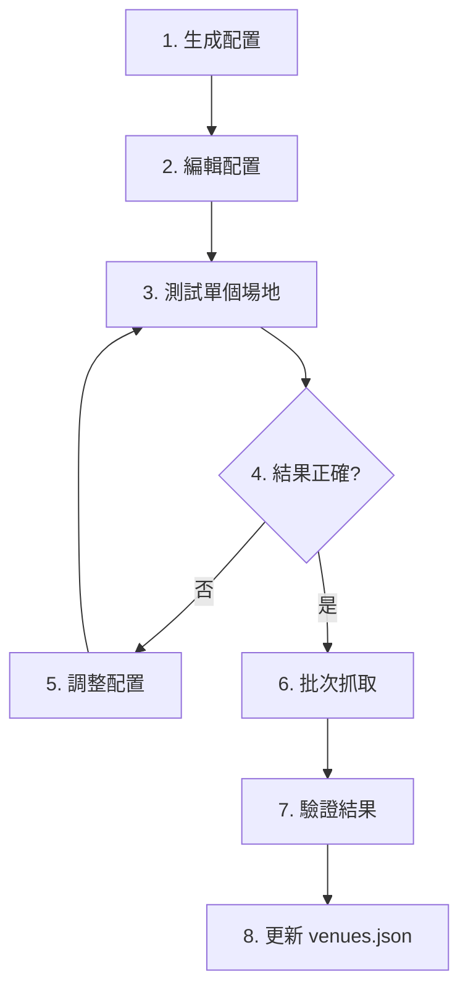

# 通用場地爬蟲框架 - 使用說明

**版本**: 2.0
**日期**: 2026-03-24
**狀態**: ✅ 已完成

---

## 📋 概述

這是一個**配置驅動的通用爬蟲框架**，可以自動抓取和驗證台灣場地資料，不需要為每個場地寫重複的程式碼。

### 核心特色

✅ **配置驅動** - 每個場地只需配置，不需重寫程式碼
✅ **多種提取器** - CSS、文字模式、表格提取器
✅ **擴展性強** - 可添加自定義提取器
✅ **批次處理** - 一次處理所有場地
✅ **Scrapling 整合** - 使用最新爬蟲技術

---

## 🚀 快速開始

### 1. 基本使用

```bash
# 生成配置檔案（從 venues.json）
python universal_venue_scraper.py --generate-config

# 抓取單個場地
python enhanced_venue_scraper.py --venue-id 1076

# 批次抓取所有場地
python enhanced_venue_scraper.py --batch
```

### 2. 配置檔案結構

```json
{
  "venue_id": 1076,
  "name": "台北寒舍艾美酒店",
  "official_website": "https://www.lemeridien-taipei.com/...",
  "sources": {
    "website": "官網 URL",
    "pricing_pdf": "價格 PDF URL（選用）",
    "dimensions_pdf": "尺寸 PDF URL（選用）"
  },
  "extractors": [
    {
      "type": "text_pattern",
      "patterns": [
        {
          "regex": "(會議室名稱1|會議室名稱2).{0,200}"
        }
      ]
    }
  ],
  "enabled": true
}
```

---

## 🎯 實際範例

### 範例 1：寒舍艾美酒店

```json
{
  "venue_id": 1076,
  "name": "台北寒舍艾美酒店",
  "sources": {
    "website": "https://www.lemeridien-taipei.com/websev?lang=zh-tw&ref=pages&id=60"
  },
  "extractors": [
    {
      "type": "text_pattern",
      "patterns": [
        {
          "name": "14間會議室",
          "regex": "(軒轅廳|室宿廳|角宿廳|河鼓廳|北河廳|畢宿廳|室宿畢宿廳|QUUBE|艾美廳|翡翠廳|珍珠廳|琥珀廳|貴賓室).{0,200}"
        }
      ]
    }
  ]
}
```

**執行**:
```bash
python enhanced_venue_scraper.py --venue-id 1076 --config venue_scraper_config_expanded.json
```

### 範例 2：六福萬怡酒店

```json
{
  "venue_id": 1043,
  "name": "台北六福萬怡酒店",
  "sources": {
    "website": "https://www.courtyardtaipei.com.tw/wedding/meeting",
    "pricing_pdf": "https://www.courtyardtaipei.com.tw/asset/.../2026_Courtyard_Taipei_banquet.pdf"
  },
  "extractors": [
    {
      "type": "text_pattern",
      "patterns": [
        {
          "regex": "(超新星宴會廳|山廳|海廳|林廳|水廳|晶廳|雲廳|風廳|光廳|戶外證婚區).{0,100}"
        }
      ]
    }
  ]
}
```

---

## 🔧 進階配置

### 1. CSS 選擇器提取器

當網站有結構化的 HTML 時使用：

```json
{
  "type": "css",
  "selectors": [".meeting-room", ".venue-item"],
  "field_mappings": {
    "name": ".title::text",
    "capacity": ".capacity::text",
    "floor": ".floor::text"
  }
}
```

### 2. 表格提取器

當會議室資訊在表格中：

```json
{
  "type": "table",
  "table_selector": "table.meeting-rooms",
  "name_column": "會議室名稱",
  "capacity_column": "容量"
}
```

### 3. 多來源整合

同時抓取多個來源：

```json
{
  "sources": {
    "website": "官網 URL",
    "pricing_pdf": "價格 PDF",
    "dimensions_pdf": "尺寸 PDF",
    "photos_gdrive": "照片 Google Drive"
  }
}
```

---

## 📁 檔案結構

```
taiwan-venues-new/
├── enhanced_venue_scraper.py          # 增強版爬蟲主程式
├── universal_venue_scraper.py         # 通用爬蟲（舊版）
├── venue_scraper_config.json          # 基本配置（自動生成）
├── venue_scraper_config_expanded.json # 進階配置（手動編輯）
├── scraped_venues_YYYYMMDD_HHMMSS.json # 抓取結果
└── README_SCRAPER.md                  # 本說明文件
```

---

## 🔄 工作流程

### 標準流程



### 步驟詳解

**步驟 1：生成配置**
```bash
python universal_venue_scraper.py --generate-config
```
這會從 `venues.json` 自動生成基本配置。

**步驟 2：編輯配置**
- 打開 `venue_scraper_config_expanded.json`
- 為每個場地添加特定的提取規則
- 參考上面的實際範例

**步驟 3：測試**
```bash
python enhanced_venue_scraper.py --venue-id 1076
```
檢查結果是否符合預期。

**步驟 4：批次執行**
```bash
python enhanced_venue_scraper.py --batch
```
一次處理所有配置的場地。

---

## 🎨 自定義提取器

### 建立自己的提取器

```python
from enhanced_venue_scraper import RoomExtractor

class MyCustomExtractor(RoomExtractor):
    def extract(self, page, text_content, config=None):
        rooms = []
        # 你的自定義邏輯
        return rooms

# 註冊提取器
scraper = EnhancedVenueScraper()
scraper.registry.register('my_custom', MyCustomExtractor())
```

### 在配置中使用

```json
{
  "extractors": [
    {
      "type": "my_custom",
      "custom_param": "value"
    }
  ]
}
```

---

## 📊 結果格式

抓取結果會儲存為 JSON：

```json
[
  {
    "venue_id": 1076,
    "name": "台北寒舍艾美酒店",
    "timestamp": "2026-03-24T21:19:25",
    "success": true,
    "rooms": [
      {
        "name": "軒轅廳",
        "extraction_method": "text_pattern"
      }
    ],
    "contact": {
      "phone": "02-6622-8000",
      "email": "cateringsales.group@lemeridien-taipei.com"
    },
    "sources": ["https://www.lemeridien-taipei.com/..."],
    "issues": []
  }
]
```

---

## ⚙️ 全域設定

在配置檔案底部設定：

```json
{
  "global_settings": {
    "default_concurrent": 5,      # 並發數量
    "timeout": 30,                # 超時時間（秒）
    "retry_attempts": 3,          # 重試次數
    "user_agent": "Mozilla/5.0"   # User Agent
  }
}
```

---

## 🐛 常見問題

### Q1: 抓取不到會議室資料？

**A**: 檢查並調整以下項目：
1. 確認官網 URL 正確
2. 調整正則表達式模式
3. 嘗試不同的提取器類型
4. 查看網站是否需要 JavaScript 渲染（使用 DynamicFetcher）

### Q2: 抓取的資料不正確？

**A**:
1. 使用瀏覽器開發者工具檢查 HTML 結構
2. 調整 CSS 選擇器或文字模式
3. 添加欄位對應規則

### Q3: 如何處理 PDF？

**A**:
1. PDF 會在 `sources` 中標記
2. 使用 PyPDF2 或 pdfplumber 解析
3. 可以擴展框架添加 PDF 提取器

### Q4: 如何處理 Google Drive？

**A**:
1. 轉換為直接下載連結：
   ```
   https://drive.google.com/uc?export=download&id=FILE_ID
   ```
2. 下載後解析（PDF、圖片等）

---

## 📈 效能優化

### 並發處理

```bash
# 調整並發數量
python enhanced_venue_scraper.py --batch
# 在配置中設定 concurrent: 10
```

### 增量更新

只抓取有變化的場地：
```python
# 在程式中檢查 lastUpdated
if venue['lastUpdated'] < threshold:
    scraper.scrape_venue(venue_id)
```

---

## 🔄 後續步驟

### 短期目標
1. ✅ 建立通用框架
2. ✅ 測試 3 個場地（六福萬怡、寒舍艾美、茹曦）
3. ⏳ 完善所有 52 個場地的配置
4. ⏳ 執行批次抓取

### 中期目標
1. 添加 PDF 解析器
2. 添加 Google Drive 下載器
3. 建立自動驗證機制
4. 整合到 venues.json 更新流程

### 長期目標
1. 建立持續監控機制
2. 自動偵測網站更新
3. 機器學輔助資料提取
4. 建立完整的資料維護系統

---

## 📞 支援

遇到問題？
1. 檢查配置檔案格式
2. 查看 Scrapling 文件：https://github.com/D4Vinci/Scrapling
3. 參考現有場地的配置範例

---

_框架建立時間: 2026-03-24_
_目前版本: 2.0_
_作者: Claude Code_
